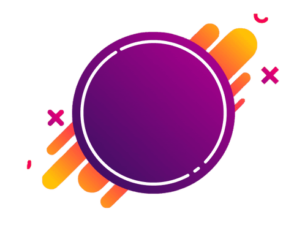
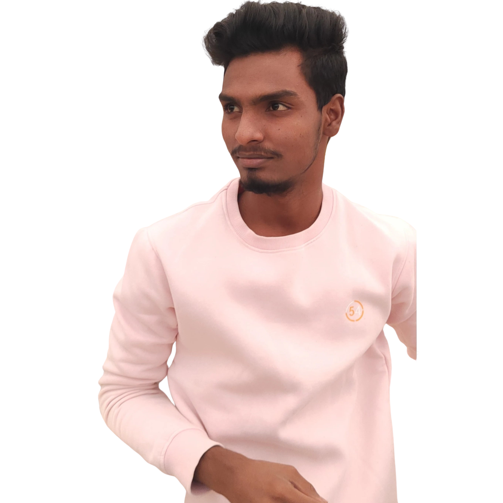

<!doctype html>
<html lang="en">
  <head>
    <meta charset="UTF-8" />
    <meta http-equiv="X-UA-Compatible" content="IE=edge">
    <meta name="viewport" content="width=device-width, initial-scale=1.0" />
    <link rel="stylesheet" href="Prakash.css" />
    <title>About Me</title>
  </head>
<body>

    

		<nav>
            
            <ul>
                <li><a href="https://www.linkedin.com/?trk=seo-authwall-base_nav-header-logo">LINKEDIN</a></li>
                <li><a href="https://drive.google.com/file/d/1C8oWm8ssy7ai4mbTssAlq_UlzmiMTLmf/view?usp=share_link">RESUME</a></li>
                <li><a href="https://instagram.com/prakash_9347_?igshid=YmMyMTA2M2Y=">INSTAGRAM</a></li>
            </ul>
        </nav>      
		    

                <h1>I,m Prakash <spam>Akkala</spam></h1>
		        
This is my official portfolio website to show all
                    Details and Skills of me. I am from a small 
                    village called Kistapur in Medak district, Telangana.
                     I completed my Diploma in Mechanical Engineering
                    with 87% in 2022.  <h3>IT Skills:</h3> 
                    <ul>
                        <li>HTML & CSS</li>
                        <li>JAVA</li>
                    </ul>

                

                <a href="https://drive.google.com/file/d/1C8oWm8ssy7ai4mbTssAlq_UlzmiMTLmf/view?usp=share_link">DOWNLOAD CV</a>
            
		  
            

                
                	
	        

</body>
</html>
